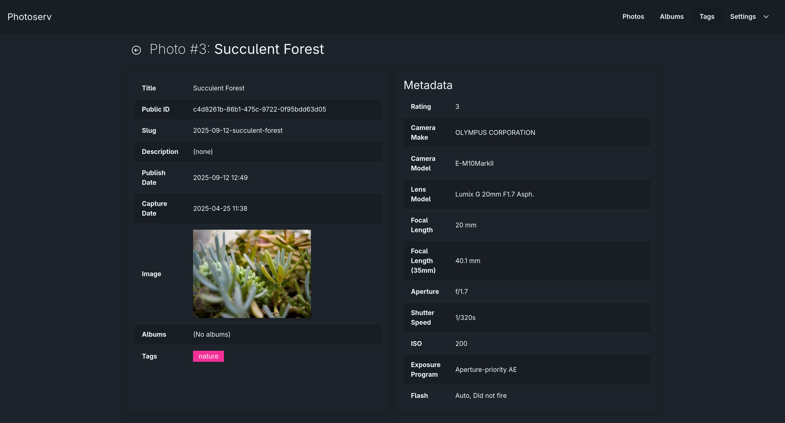
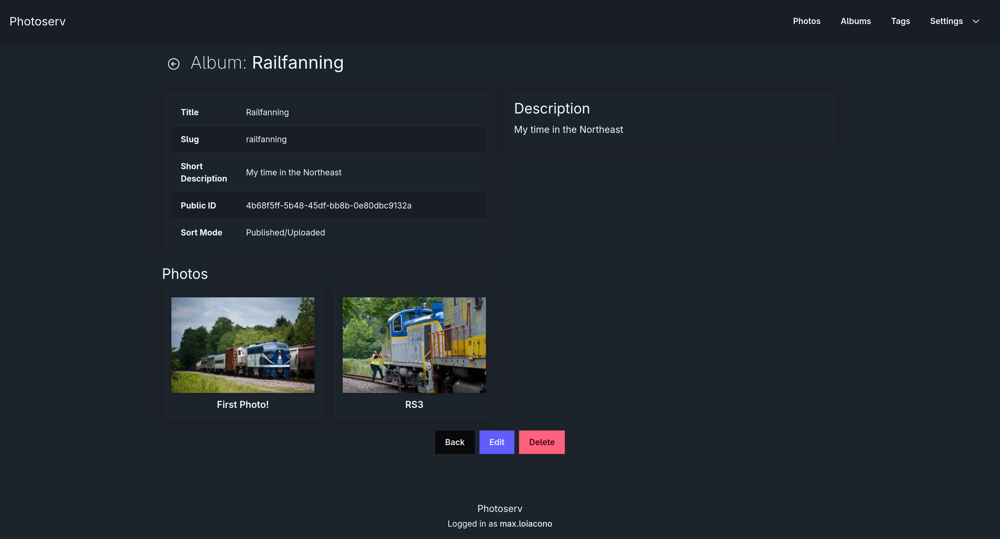
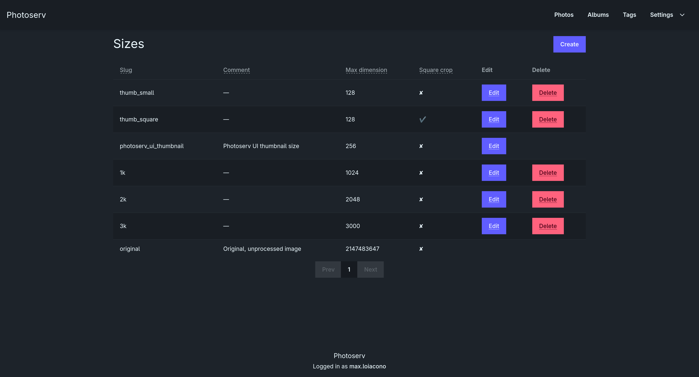
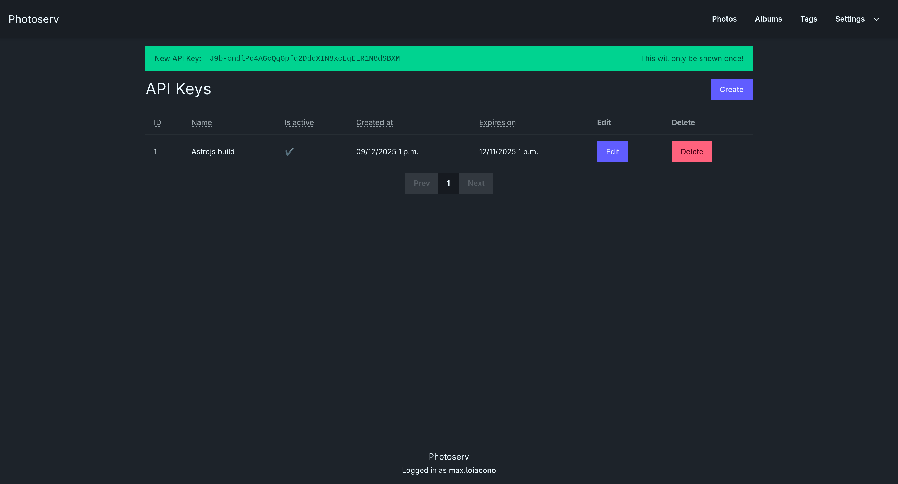

# Photoserv

Photoserv is an application for photographers, artists, or similar who want a system to act as a single source of truth
for their publicly published photos.

|  |  |
| --- | --- |
|  |  |

## Features

* Upload and categorize photos by albums and tags.
* Extract metadata from photos for consumption in other systems.
* Exposes a REST API for applications and integrations to interact with your data.
    * For example, a photo portfolio website in Astro.js can consume this.
    * Swagger API browser included.
* Define multiple sizes for your photos to be available in.
* OIDC and simple auth optional.

## Installation

1. Configure (below)
2. `docker compose up -d`

## Configuration

Configure the environment variables; `cp example.env .env`

```env
# openssl rand -hex 64
APP_KEY=""

DEBUG_MODE=false # always false in production

TIME_ZONE=America/New_York

DATABASE_ENGINE=postgres # postgres or sqlite
DATABASE_USER=photoserv
DATABASE_PASSWORD=photoserv
DATABASE_NAME=photoserv
DATABASE_HOST=database
DATABASE_PORT=5432

REDIS_HOST=redis
REDIS_PORT=6379

ALLOWED_HOSTS=127.0.0.1,localhost # Add photoserv domain here

SIMPLE_AUTH=True # Recommended to disable if you use OIDC

# Each of OIDC_CLIENT_*, OIDC_*_ENDPOINT must be filled to enable OIDC
OIDC_NAME=Single Sign On Button Label
OIDC_CLIENT_ID=
OIDC_CLIENT_SECRET=
OIDC_AUTHORIZATION_ENDPOINT=
OIDC_TOKEN_ENDPOINT=
OIDC_USER_ENDPOINT=
OIDC_JWKS_ENDPOINT=
OIDC_SIGN_ALGO=RS256 # optional
```

OIDC Callback URL: `<your-photoserv-root>/login/oidc/callback/`  
Example: `https://photoserv.domain.com/login/oidc/callback/`

## API Documentation

Once set up, visit `https://<your-instance/swagger` for an interactive Swagger API browser.

> [!NOTE]
> You will have to create an API key from within Photoserv (`Settings > Public API`) before
using Swagger.

## Security

While I've made my best effort to secure this application, leaning on existing solutions and libraries where possible,
I am one person, and I cannot guarantee it is *perfect*. It is not recommended to expose this application
directly to the internet. Ideally:

* Run this application by a reverse proxy (ports are commented out by default in `docker-compose.yml`).
* Use a tunnel or on-prem runner to build derivative websites off of the API.
* If necessary, try to only expose the public api (`/api`).
* Otherwise, put the frontend in front of a proxy-auth middleware like Authentik.

### Examples (Traefik + Authentik)

Assume:

* `websecure` - internal HTTPS
* `websecure-external` external access HTTPS

#### Internal access only

```
- "traefik.http.routers.photoserv.rule=Host(`photoserv.domain.com`)"
- "traefik.http.routers.photoserv.entrypoints=websecure"
- "traefik.http.services.photoserv.loadbalancer.server.port=8000"
```

#### Public API Only, Private Front End

```
- "traefik.http.routers.photoserv.rule=Host(`photoserv.domain.com`)"
- "traefik.http.routers.photoserv.entrypoints=websecure"
- "traefik.http.routers.photoserv.service=photoserv"

- "traefik.http.routers.photoserv-external.rule=Host(`photoserv.domain.com`) && PathPrefix(`/api`)"
- "traefik.http.routers.photoserv-external.entrypoints=websecure,websecure-external"
- "traefik.http.routers.photoserv-external.service=photoserv"

- "traefik.http.services.photoserv.loadbalancer.server.port=8000"
```

#### Proxy Auth Front End with Public API

```
- "traefik.http.routers.photoserv.rule=Host(`photoserv.domain.com`) && PathPrefix(`/api`)"
- "traefik.http.routers.photoserv-external.entrypoints=websecure,websecure-external"
- "traefik.http.routers.photoserv.service=photoserv"

- "traefik.http.routers.photoserv-external.rule=Host(`photoserv.domain.com`)"
- "traefik.http.routers.photoserv-external.entrypoints=websecure-external"
- "traefik.http.routers.photoserv-external.middlewares=authentik@docker"
- "traefik.http.routers.photoserv-external.service=photoserv"

- "traefik.http.services.photoserv.loadbalancer.server.port=8000"
```

## Roadmap

1. ~~Better documentation~~
2. ~~Mobile layout~~
3. ~~Add feature to hide photos from the UI~~
4. Consistency checker
5. ~~API documentation~~
6. ~~Security/traefik documentation~~
7. ~~Album Parents~~
8. ~~Jobs overview~~
9. ~~API response metadata~~
10. ~~EV comp filter~~
11. Photo formset
12. 1.0 release
13. 1.1: Webhooks
14. 1.2: Social integration
